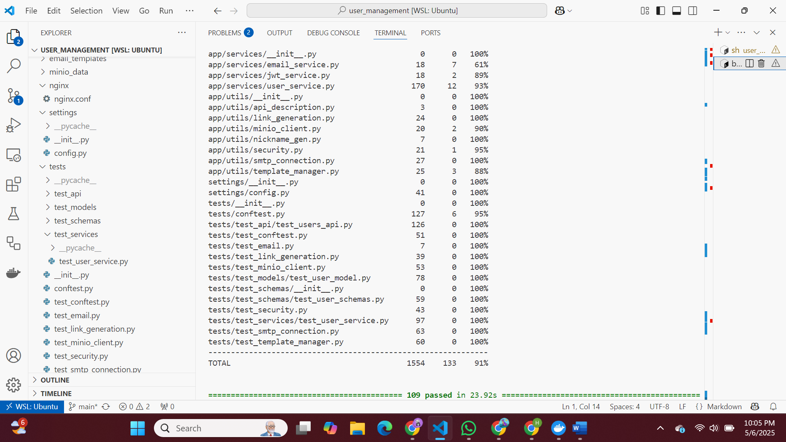
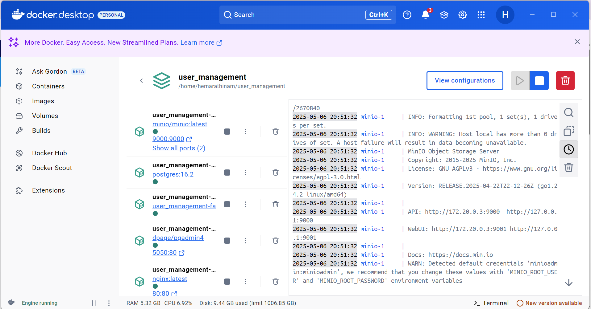
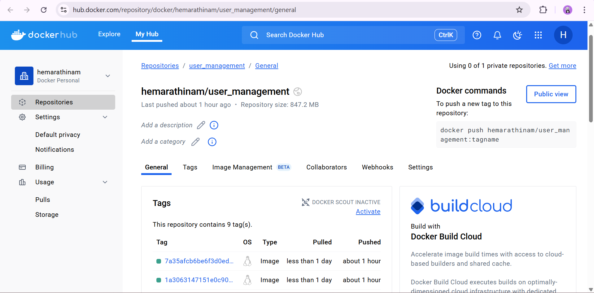

# User Management System🎉
Repo Link: https://github.com/Hemavathi-2107/user_management

## Project Objective

The User Management System project aimed to develop a secure, feature-rich application for managing user accounts, roles, and permissions. It includes functionalities such as user registration, authentication, and advanced features like Minio profile picture upload. The project emphasizes modern development practices, integrating CI/CD pipelines, Dockerized deployment, and comprehensive testing. With a focus on scalability and security, the system meets real-world web application standards while offering a seamless user and administrator experience. Successful deployment to DockerHub highlights the project's production readiness.

### Goals

* Fixed five QA issues/bugs across the codebase.
* Implemented a new feature: **Profile Picture Upload with Minio**.
* Created **10 new tests** for the newly implemented feature.
* Included a **Reflection Document** for the course.

---

## Setup and Preliminary Steps

Follow these steps to get the project up and running locally:

1. **Fork the Repository**

   * Fork the project repository to your GitHub account.

2. **Clone the Repository**

   ```bash
   git clone https://github.com/Hemavathi-2107/user_management.git
   ```

3. **Navigate to the Project Directory**

   ```bash
   cd user_management
   code .  # Open in VS Code (optional)
   ```

4. **Install and Setup Docker**

   * Ensure Docker is installed and running on your machine.

5. **Verify Project Setup**

   * Follow the instructor’s video guide or run the commands below to build and start the services:

     ```bash
     docker compose up --build
     ```
   * Check that you can access:

     * API documentation: `http://localhost/docs`
     * PGAdmin: `http://localhost:5050`

6. **Apply Database Migrations & Run Tests**

   ```bash
   # Run tests
   docker compose exec fastapi pytest

   # Apply migrations
   docker compose exec fastapi alembic upgrade head

   # Optional: Seed or interact with Minio client
   docker compose exec fastapi python3 -m app.utils.minio_client
   ```

---

## Accessing Services

* **PgAdmin**: [http://localhost:5050](http://localhost:5050)
* **Swagger UI (FastAPI Docs)**: [http://localhost/docs](http://localhost/docs)
* **Minio Console**: [http://localhost:9001](http://localhost:9001)
* **Minio API Endpoint**: [http://localhost:9000](http://localhost:9000)

---

## Issues Fixed

1. **Fix Dockerfile allow build libc-bin version permit** ([#1](https://github.com/Hemavathi-2107/user_management/issues/1))

   * Added `--allow-downgrades` for `libc-bin` to resolve version mismatches during build.

2. **Profile picture URL validation** ([#4](https://github.com/Hemavathi-2107/user_management/issues/4))

   * Ensured URLs end with valid image extensions (`.jpg`, `.jpeg`, `.png`) and are well-formed.

3. **User ID `None` in verification email** ([#6](https://github.com/Hemavathi-2107/user_management/issues/6))

   * Fixed email workflow to include the correct User ID upon creation or update.

4. **Nickname uniqueness in registration** ([#8](https://github.com/Hemavathi-2107/user_management/issues/8))

   * Removed `generate_nickname()` call; enforced user-provided nickname and database uniqueness checks.

5. **Password validation in registration** ([#10](https://github.com/Hemavathi-2107/user_management/issues/10))

   * Enforced strong-password rules: min length 8, uppercase, lowercase, digit, special character.

6. **Email verification preserves roles** ([#15](https://github.com/Hemavathi-2107/user_management/issues/15))

   * Fixed role assignments during the email verification process to prevent unintended downgrades.

---

## Profile Picture Upload with Minio

Enhances user profiles with personalized images stored securely in Minio.

### Implementation Details

1. **API Endpoint**

   * Created a dedicated route for profile picture uploads.
   * Validates file type (`JPEG`, `PNG`, `GIF`) and size (max 5MB).

2. **Minio Integration**

   * Configured a Minio bucket for image storage.
   * Generated unique object keys to prevent overwrites.
   * Utilized Minio REST API for uploads and URL retrieval.

3. **Profile Schema Update**

   * Added a `profile_picture_url` field to the user model.
   * Updated response serializers to include the image URL.

4. **Image Retrieval**

   * Fetched URLs from Minio for display.
   * Implemented pre-signed URLs for secure, time-limited access.
   * Provided a default avatar for users without images.

---

## Final Project Output

* View the system in action: [User Management Output](https://github.com/Hemavathi-2107/user_management/blob/main/Documentation/user_management_output.md)

---

## Testing & QA

* **Added 10 new test cases:**

  * [Tests 1–4](https://github.com/Hemavathi-2107/user_management/issues/19)
  * [Tests 5–8](https://github.com/Hemavathi-2107/user_management/issues/21)
  * [Tests 9–10](https://github.com/Hemavathi-2107/user_management/issues/23)

### Unit & Integration Tests

1. Upload Profile Picture with bytes
2. Upload Profile Picture with file-like object
3. Upload with unsupported extension
4. Get profile picture URL
5. Successful email send
6. Authentication failure
7. Recipient refusal
8. Generic connection exception
9. Missing template error
10. HTML inlining for email

**Test Coverage:** >91% 

---

## Docker Deployment

  

**DockerHub Repository:** [hemarathinam/user\_management](https://hub.docker.com/repository/docker/hemarathinam/user_management/general)

---

## Reflection Document

For an in-depth reflection, see: [Reflection Document](https://github.com/Hemavathi-2107/user_management/blob/main/Documentation/reflection.md)
